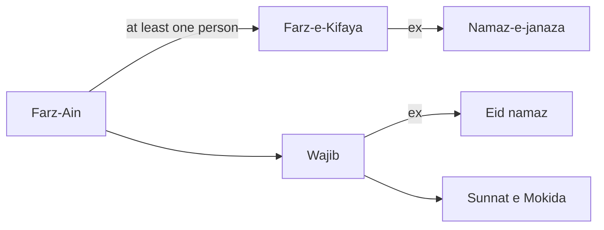
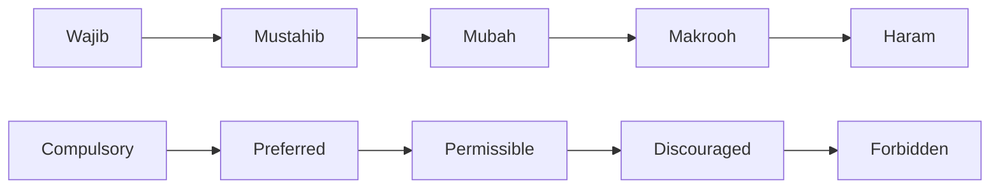
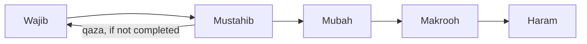

Book: Tafheem ul Fiqh

---

### 1. Types of Actions

Book page: 124 (important principles)

| Type                                           | Descr                                                        | Sawab applies   | Gunah                      | Kufr, If rejected | Example                                                      |
| ---------------------------------------------- | ------------------------------------------------------------ | --------------- | -------------------------- | ----------------- | ------------------------------------------------------------ |
| Farz Ain                                       | Compulsory farz. Proven by Quran. Rejection leads to kufr. (Hukm because in Quran; Hadees mutawatir*) | Yes             | Yes; if not done           | Yes               | Namaz                                                        |
| Farz-e-Kifaya                                  | At least one of community must do it. Kifaya meaning ???     | Yes             | Yes; if not done by anyone | No?               | Namaz -e- janaza                                             |
| Wajib                                          | Compulsory but rejection does not lead to kufr.              | Yes             | Yes                        | No                | Eid namaz                                                    |
| Sunat -e- Mokida (mokida = takeed)             | Always done by Prophet, except for allowed excuse. e.g. gunah if skipping sunnat namaz as a habit. | Yes             | Yes; if no excuse          | No                | Reduced rakaat during travel                                 |
| Sunat -e- Ghair-Mokida (likely aka Masnoon ??) | Optional by Prophet.                                         | Yes             | No                         | No                | Asar & Isha 4 sunah (pre-farz). Wudu's sunnats??             |
| Mustahib (preferable)                          | Relatively less performed by Prophet (compared to Sunat-e-ghair mokida) | Yes             | No                         | No                | Miswaak?, Nifil ?, Charity?, Documented business dealing     |
| Haram                                          | Sawab if avoided;                                            | Yes; if avoided | Yes                        | Yes               |                                                              |
| Makrooh -e-Tehreemi                            | Makrooh = not liked. Weak proof. (Tehreemi = nearing haram)  | Yes; if avoided | Yes                        | No                | ?                                                            |
| Makrooh -e- Tanzeehi                           | Sawab if avoided; but no gunah if done                       | Yes; if avoided | No                         | No                | divorce?, buying something, for which someone else has made an offer (my swappa situation) |
| Mubah                                          | No sawab or gunah. Personal discretion. Halal.               | -               | -                          | -                 | eating, laugh, jokes, etc. (but they can also be sawab based on niyat) |

\*  hadees mutawatir = continuously repeated = more authentic

Fasiq = gunah, but not kafir

If a Nafil is started, but not completed e.g. nafil roza, then its qaza becomes wajib

### 2. Illness or Injury

### 3. Traveler

