https://www.youtube.com/watch?v=SHNMiOZaywg

Quran word-by-word: https://islamicstudies.info/quran/wordtranslation.php

Fiqh Book: [66-Tafheen-Ul-Fiqah-Jild-2](https://ia801308.us.archive.org/9/items/TAFHEEMULFIQHMUHAMMEDNAEEM/TAFHEEM%20UL%20FIQH%20-%20MUHAMMED%20NAEEM.pdf)

Research by Imam Abu Hanifa

Translated from Noor ul Eezah ????? (see intro text ...) first year textbook for Alim course.

### 12/17/2021

1. Aqaid (beliefs)
2. Ibadaat (Prayers)
3. Maamlaat (Business Dealing)
4. Maasharat (Social)
5. Ikhlaqyaat (Character)

Today's focus: Ibadaat (Prayers)

---

We are Muslim by birth. We are told steps by our elders.

**Many things are easier than we think. But we should study and know.**

An example:  Wudu for Namaz during travel

---

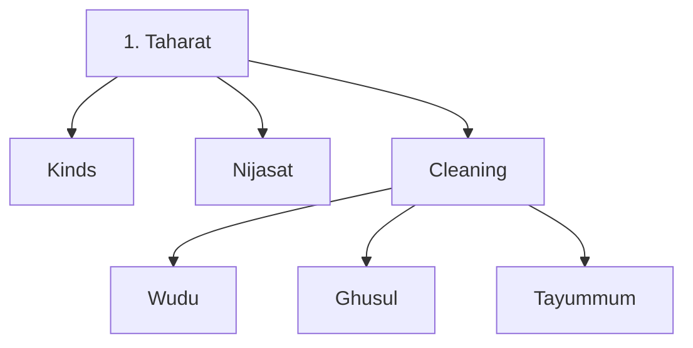

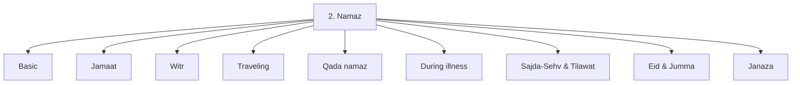

```mermaid
graph LR

```

#### Book organization

##### Kitab > Bab > Fasl


---

#### Minimal wudu:

1. Wash face
2. Wash hands till elbow
3. Wipe head
4. Wash feet till ankles

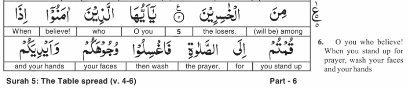

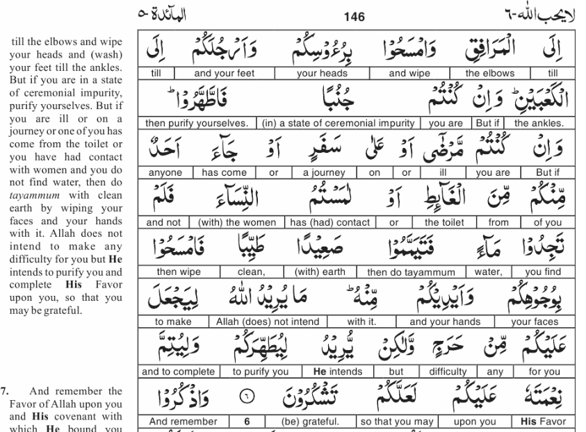

https://islamicstudies.info/quran/wordtranslation.php?ch=5&v=7

From fiqh book: 

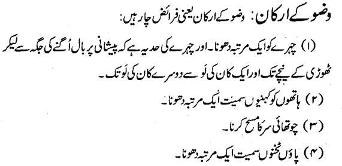

masah = touch head with wet hand

---

Book page: 124 (important principles)

| Type                                           | Descr                                                        | Sawab applies   | Gunah                      | Kufr, If rejected | Example                                                      |
| ---------------------------------------------- | ------------------------------------------------------------ | --------------- | -------------------------- | ----------------- | ------------------------------------------------------------ |
| Farz Ain                                       | Compulsory farz. Proven by Quran. Rejection leads to kufr. (Hukm because in Quran; Hadees mutawatir*) | Yes             | Yes; if not done           | Yes               | Namaz                                                        |
| Farz-e-Kifaya                                  | At least one of community must do it. Kifaya meaning ???     | Yes             | Yes; if not done by anyone | No?               | Namaz -e- janaza                                             |
| Wajib                                          | Compulsory but rejection does not lead to kufr.              | Yes             | Yes                        | No                | Eid namaz                                                    |
| Sunat -e- Mokida (mokida = takeed)             | Always done by Prophet, except for allowed excuse. e.g. gunah if skipping sunnat namaz as a habit. | Yes             | Yes; if no excuse          | No                | Reduced rakaat during travel                                 |
| Sunat -e- Ghair-Mokida (likely aka Masnoon ??) | Optional by Prophet.                                         | Yes             | No                         | No                | Asar & Isha 4 sunah (pre-farz). Wudu's sunnats??             |
| Mustahib (preferable)                          | Relatively less performed by Prophet (compared to Sunat-e-ghair mokida) | Yes             | No                         | No                | Miswaak?, Nifil ?, Charity?, Documented business dealing     |
| Haram                                          | Sawab if avoided;                                            | Yes; if avoided | Yes                        | Yes               |                                                              |
| Makrooh -e-Tehreemi                            | Makrooh = not liked. Weak proof. (Tehreemi = nearing haram)  | Yes; if avoided | Yes                        | No                | ?                                                            |
| Makrooh -e- Tanzeehi                           | Sawab if avoided; but no gunah if done                       | Yes; if avoided | No                         | No                | divorce?, buying something, for which someone else has made an offer (my swappa situation) |
| Mubah                                          | No sawab or gunah. Personal discretion. Halal.               | -               | -                          | -                 | eating, laugh, jokes, etc. (but they can also be sawab based on niyat) |

\*  hadees mutawatir = continuously repeated = more authentic

Fasiq = gunah, but not kafir

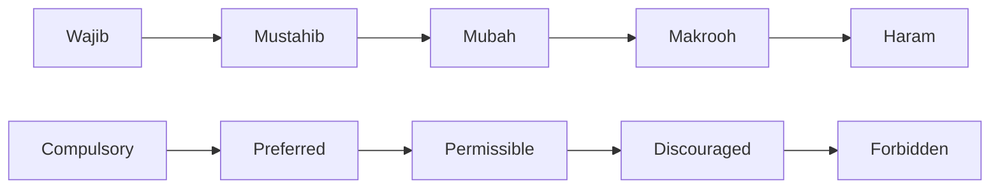

**Namaz**

| Time                                  | Farz | Sunnat Namaz (Muakkidah=strongly recommended) | Sunnat Namaz (Ghair-Muakkidah) |
| ------------------------------------- | ---- | --------------------------------------------- | ------------------------------ |
| Fajr                                  | 2    | 2 sunnats (before farz)                       | N/A                            |
| Zuhr                                  | 4    | 4 sunnats before + 2 sunnats after            | N/A                            |
| Asr                                   | 4    | None                                          | 4 sunnats                      |
| Maghrib                               | 3    | 2 sunnats (after farz)                        | N/A                            |
| Isha                                  | 4    | 2 sunnats after farz                          | 4 sunnats before               |
| Jumma (instead of Zuhr, but together) | 2    |                                               |                                |


### 12/18/2021

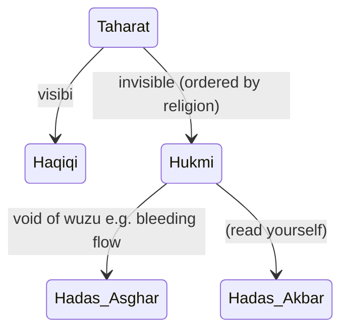

bleeding flow = ??? visible ???

bigger: biggest :: kabeer : akbar
smaller: smallest :: sagheer : asghar


| Nijasat Category | Fixed via | Example | Notes                                        |
| ---------------- | --------- | ------- | -------------------------------------------- |
| Hadas asghar     | wudu      | gas     | Not touching Quran in this condition (56:79) |
| Hadas akbar      | ghusul    |         |                                              |
|                  |           |         |                                              |


---

### Wudu

- compulsory for namaz and touching quran (ebook/tablet???) 
  - book where majority text is Quran

- a person in wudu earns sawab continuously

**4 requirements (Farz):**

1. Wash face (ear to ear, forehead hairs to chin)
2. Wash hands till elbow
3. Wipe head (masah: min. touching 1/4 of head e.g. two palms)
4. Wash feet till ankles

**Conditions:**

- water flow, even if reused. Wiping with towel is not sufficient.
- skin not being blocked e.g. elfy, paint, wax, paint
- not breaking wudu during doing wudu

**Scenarios**

- Paint sticking on muscles (Above elbow). Ok for wudu.
- Bandages are okay if injury

**When wudu is wajib (required)** (first 3 are also applicable to most other ibadaat)

- Person should be Baliqh (Still teach them to do wudu as a tarbeeyat)
- Person should be Mentally stable 
- Person should be Muslim
- Having sufficient water
- To clean oneself from hadas asghar (gas, #1, etc.)
- Wudu is still wajib even if prayer time is less (point of importance)

Note: wudu is not enough to remove hadas akbar - must do qusul (see page 46 / pdf 80)

**Sunnat-ian of Wudu** (*likely Sunat-e-Ghair mokida = higher sawab if done; no penalty if missed*)

1. doing niyat
2. reciting Bismillah 
3. washing hands 
4. miswak or clean teeth with right index finger (70x more sawab)
5. kulli 3x (if not in roza; then gargle)
6. nose cleaning 3x (till nostril/cartilage; right hand to put water; left hand to clean nose)
7. Doing the farz (4 steps) 3 times. Rubbing them.
8. Masah of full head  (farz was 1/4 head)
9. Masah of ear (internal: using index finger - in to out, external: using thumb - bottom to up)
10. Beard khilal (palm facing upward; moving from neck to forward)
11. Hands/Feet fingers khilal (to ensure fard is not missed; no dry portion b/w fingers)
12. No time gaps b/w steps of wudu (don't let body parts get dry b/w wudu steps)
13. Ensuring order of doing 4 fard steps (face > hands > head > feet)
14. Right first - then left
15. Front first - then back (Head Masah order)

**Mustahab of Wudu** (*some sawab if done; no penalty if missed*)

1. Sitting a high place. Used water does not spill on oneself.

2. Sitting facing qibla

3. Doing without any help

4. Not talking to others during wudu

5. Reciting dua during wudu:
   
   
   
6. Niyat with tongue

7. Saying Bismillah at every step (if smelly/dirty washroom; cannot do Bismillah there; do it outside before going in)

8. Wet fingers in ear holes (during ear masah)

9. Moving a ring (so that water reaches below)

10. Doing steps with correct hands (as above): e.g. right for kulli and left hand to clean nose, etc. 

11. Doing wudu before namaz time

12. End of wudu dua (kalma + dua)  (if smelly/dirty washroom; do it outside after going out).

    - Look upwards when reciting dua
    - 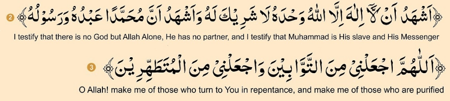


**Makroohat of Wudu** *(likely Makrooh-e-tanzeehi: sawab when avoided; no penalty if done)*

1. Using excess water.
   - Running water during doing masah
   - Opening water tap at full flow when reduce can also work
   - in case of flowing water; putting your hand and making water used
2. Using very less water, if it is available.
3. Splashing water around e.g. during washing face
4. Talking to others during wudu
5. Asking others for help to do wudu -- without any excuse e.g illness, disability
6. Using new water for 3x masah (??? 3x --- nomi to check)
7. Closing eyes tightly during washing face, so eyes lids etc are not properly cleaned (e.g. cheepar)

**Types of wudu**

| Types of Wudu | Example                                                      | Notes                                                        |
| ------------- | ------------------------------------------------------------ | ------------------------------------------------------------ |
| Farz          | - Any namaz (including janazah)<br />- Sajda tilawat<br />- Touching Quran | Sajda tilawat required for listening from live (person, amplier speaker, online live, child recitation), but not for recorded. *(iA to go deeper in roots of this topic)*<br /><br />Touching Quran:<br />reciting with memory is ok without wudu only for hadas-asghar<br /><br />Sceanarios: Is it okay to touch without hadas-asghar?<br />- full arabic Quran (no)<br />- arabic + majority is translation (yes - ok???)<br />- paper with written Quran -- (ok to touch from blank portions)<br />- some books with Quran ayat as title (not preferred)<br />- ayats on wall (house) - how to remove it? (nomi to check???)<br />- ayats on neclace etc. (no)<br />- Phone/tablet -- treat like picture. Flexibility in religion. (Do not touch quran words, but use the app from border) |
| Wajib         | (read yourself)                                              | Page 36 (pdf: 70)                                            |
| Mustahab      | (read yourself)                                              | Page 37 (pdf: 71)                                            |


**Next topic:** 

Urdu Pages 2, 32-35, 256

Pdf pages: 35, 66-69, 292


---

#### 12/31/2021

Page 35

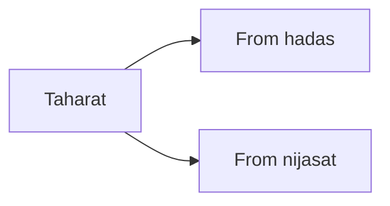


**Reading Assignment:** Page 25-30 (pdf: 59-63)

##### ### 

---

####  in1/7/2022

- qahqaha during namaz does not seems logically correct, but breaks wudu because of sunnat guidance

  - aqal vs wahi

    - e.g. two brother sister living together and have understanding, but still when they are married sister goes to another house, and brother gets married to a stranger who has less understanding of this house. This does not seems logical, but we have been told via wahi that certain relationships are not allowed.
    - TODO: read other example in asan tarjuma quran page mufti taqi usmani (page 13, pdf 14)

    

----

### 1/8/2022

### What does not break wudu

- if nijasat (e.g. blood) does not flow
- if male is doing namaz according to sunnat (no lean), then wudu is ok, if the person sleep in the middle
- for female is (since they put whole elbows on ground in sajda), sleeping in sajda breaks the wudu

Do exercises on page 43 / pdf 77

---

### Ghusul / Bath

**3 Farz:**

1. Kulli + Gargle (avoid gargle if fasting to avoid any mistake)
2. Washing nose (till cartilage)
3. Flowing water on whole body without leaving even a hair-sized portion dry

If bath is required/imposed,

- the person cannot do ibadaat
- cannot read Quran
- cannot go to mosque

**Sunnats Steps of Bath**

1. Saying "Bismillah" (complete) before starting

2. Wash/clean both hands - just like wudu

3. Wash nijasat on clothes or body 

   1. nijasat has two parts: its body (material) and its color
   2. flow water so that its body is completed removed, e.g. blood light color can remain, but its better to clean it too (e.g. with detergent)

4. do wudu. If used water is collecting at some place (tub or nali blocked), then wash feets later

5. Wash body 3 times

6. Do in order: Head > Right shoulders > Left shoulders > full body

7. Rub body to clean it

8. No delay in steps - Wash whole body so that during washing no previously washed part gets dry

**When Bath is due (compulsory)**

1. janabat (leak when adult)
1. women; monthly period
1. women; after giving birth
1. Giving bath to dead body is also farz (there will be conditions later)

**When Bath is masnoon (sunnat e ghair-mokida ??)**

1. Taking bath on Friday between Fajr and Jumma namaz (for folks on which Friday namaz is compulsary)
2. Taking bath on Eid day after Fajr (for folks on which Eid namaz is compulsary)
3. Before wearing ahram for hajj or umra
4. On day of arafa after zawal ?? (for person doing hajj)

**When Bath is mustahib (optional; good if done)**

1. For Shab-e-barat (15 Shaban) at night, Shab-e-Qadr at night
3. For namaz of solar and lunar eclipse (salat-ul-kusoof/khusoof), or namaz -e- is-tas-qa (for requesting rain??)
4. <u>*Before asking forgiveness from Allah, or When in fear,*</u> or When its dark during day, or tornado is approaching
5. Visiting a gathering, wearning new clothes
6. After returning from a long trip
7. Before visitng Mecca or Medina, At Muzdalifa (10 zilhij after fajr), Before Tawaf, Before throwing rocks (at Mina) during hajj 
8. After giving bath to a dead body
9. After recovering from unconsciousness (e.g. after full anesthesia surgery)
10. Before entering Islam (reciting kalma), taking bath is mustahib - unless compulsory conditions apply (at that time it is farz).

**Cautions/Differences:**

1. Similar manners as wudu, except during ghusul: avoid facing qibla due to lack of covering on body
2. Ensure kulli (farz of ghusul). Drinking mouthful of water is ok.
3. If some food in stuck in mouth, it may limit reaching water everywhere in mouth - thus ghusul is not done.

**Quiz**

- If someone does farz of wudu, and washes body -- is qusl done ? No (because minimal/farz step of gusl (kulli, nose) is not done)
  - Wuzu farz
    - Wash face (ear to ear, forhead hairs to chin)
    - Wash hands till elbow
    - Wipe head (masah: min. touching 1/4 of head e.g. two palms)
    - Wash feet till ankles
  - Gusl Farz
    - **Kulli + Gargle (avoid gargle if fasting to avoid any mistake)**
    - **Washing nose (till cartilage)**
    - Flowing water on whole body without leaving even a hair-sized portion dry

- Why dead body should be given gusl
  - Body is an amanat (temporary grant, which must be returned properly)
  - For respect of muslim body even after soul has left it
  - Respect: We even bury papers of quran in ground, if they are too old
  - Hadees: After being dead, the murda person (soul) hears what we say to them at their grave


---

### 1/15/2022

### Tayamumm

Surah nisa:43

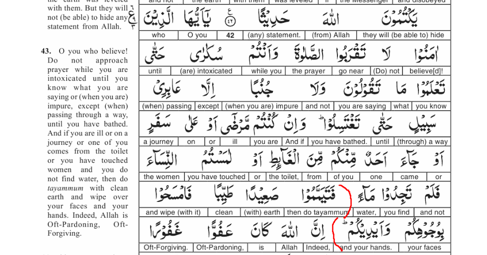

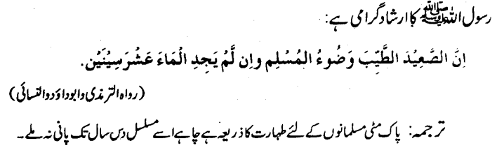

#### Farz

1. Masah of face (mash=touch, masha=move hand over)
2. Masah of hands till elbows

#### Sunats of tayammum

1. Starting with "Bismillah"
2. Doing in order: Face > Right arm > Left arm

#### Method using clean sand

1. Open culfling - till elbow
2. Move hands in sand with spread finger. Then afterwards shake hands to remove excess dirt
   - Then clean face, as if done with water
3. Do same step #2 back in sand, but this time do step for right arm
4. Do same step #2 back in sand, but this time do step for left arm
5. Ensure full coverage: masah between fingers, behind rings, bangles, ...

#### What to use for tayam-mum

- Sand or its derivative e.g. rock, marble, ... (keep a marble with you)
- Cannot be done on petro-chemicals e.g. oil paint or plastic
- Cannot be done on plants ??? wood ???


```
Tayammum is not necessarily performed by striking one's palms on earth proper. It is sufficient to strike the palms on anything which either has dust over it or anything consisting of the dry elements of the earth. It may be asked how one attains purity by striking one's palms on the earth and then wiping one's hands and face with them. 

In fact tayammum is a useful psychological device to keep the sense of ritual purity and the sanctity of Prayer alive in man's mind even when water (the principal agent of purification) is not available. The value of tayammum is that even if a man is unable to use water - and no one knows how long this situation may persist - his sensitivity to cleanliness and purity will endure. He will continue to observe the regulation laid down by the Law in respect of cleanliness and purity, and the distinction between the states in which one may and may not perform the Prayer will not be erased.
```

ref: http://islamicstudies.info/reference.php?sura=4&verse=43

### 1/21/2022

#### Conditions of Tayammum

1. Niyat (intent in heart)

   1. Tayammum MUST be done for the intent of ibadat. 
      1. Intent should be broad and not limited intent.
      2. Intent should not be something limited e.g. tayammum for touching Quran (which requires wudu), doing azaan
      3. Intent should not be for non-ibadat e.g. cleaning self for picking something worldly e.g. math book

2. Excuses when tayammum can be done

   1. Water is a mile away

   2. If by using water, either will happen: (self-judgement or by doctor with religious knowledge)

      - new illness will occur
   
      - existing illness will increase

      - existing illness will extend duration of recovery

   3. water is very hot or cold to use, and self-judgement is that wudu can lead to severe illness/death

   4. water is so less, that there is nothing to drink
   5. near water, but no means or very difficult to get access to water e.g. no pail to get from well, fear of animals/enemy attack
   6. 
   
   
   
   

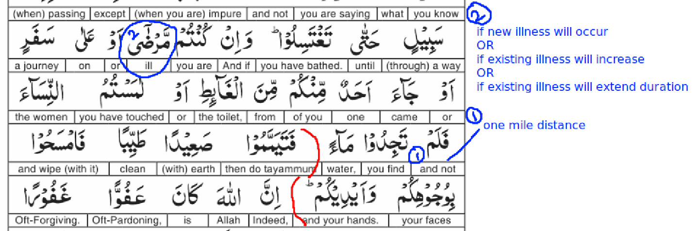


How to do Self-judgement vs How to avoid Weham vs Laziness

- Thought: Do I have wudu or not? How to decide?

  - Having such strong belief that the person can do "qasam" (which requires kaffara if broken)

  - e.g. If the person can do "qasam" that wudu is broken, then the person should do wudu
  - if person cannot do qasam, then person should decide of not to do wudu and remove weham from mind


1 mile vs Unit of time: 

- flexibility from shariah vs putting extra stress on self
- common measure for rich and poor

https://thewudhusocks.com/


#### 2/4/2022

Page 57 / pdf 90

### Exercises for Tayamum

1. When tayamum breaks:
   1. Everything that breaks wudu
      1. Liquid flow from body e.g. blood, 
         1. Scratch (no blood flow) does not break wudu
      2. Laughing during namaz
      3. Talking to another human during namaz:
         1. Saying AlHamdolillah during namaz does NOT break (saying to self)
         2. Saying Yarhamukullah during namaz DOES break wudu (saying to other human)
      4. Sleeping breaks wudu
      5. Slight sleepy (oong) during namaz
         1. Standing (no leaning) does not break wudu
         2. Sleeping in Sajda (male; no leaning) does not break wudu
         3. Sleeping in Sajda (female; leaning on ground) breaks wudu
   2. If water becomes available
   3. Person was not touching water due to illness .. 
      1. tayamum is okay, but tayamum breaks as soon as illness is gone.
2. Difference b/w **tayamum of wudu** and **tayamum of ghusul**
   1. None
3. Tayamum niyat is compulsary
   1. Yes. And the intent can be any: e.g. touching quran, doing azaan, doing namaz, doing
   2. Only tayamum valid for that intent.
4. Material which burns or melts or decomposes in sand is NOT allowed for tayamum.
   1. But dust on that material is okay to do tayamum
   2. OK to do tayamum on any direct/organic/natural derivative of earth: Anything with dust, marble, sand, brick, cloth seat with dust, cement block
      1. e.g. plastic is a chemically/artificial derivative CANNOT be used for tayammum. (similarly water is used for wudu but sheera (sugar+water) cannot be used)
   3. Not OK to do tayamum: wooden furniture, glass, carpet, cloth, coal, book, plastic
5. Tayamum of Namaz > covers > Tilawat
   1. But vice versa is not valid
   2. Tilawat (without touching Quran) anyway does not requires wudu (removing hadas akbar is required)
6. Namaz for which there is no qaza: eid namaz, namaz-e-janaza
   1. If jumma namaz will pass, its qaza is zuhr namaz.
7. Tayamum allowed if time is running out for namaz without qaza
8. Tayumum 

