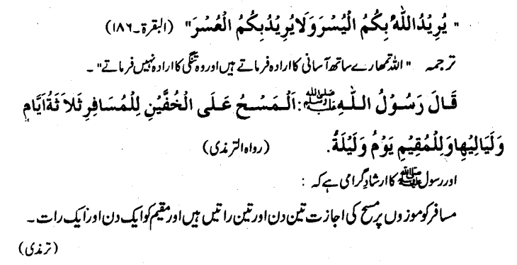

2/11/2022

### Masah on socks

Why:

- if traveling
- if not travelling but being lazy (?) -- in contrast to tayammum (laziness is not allowed)
- 




| Role **  | Masah can be done upto * | Duration Example                                             | Role Transition                                              |
| -------- | ------------------------ | ------------------------------------------------------------ | ------------------------------------------------------------ |
| Resident | 1 day and 1 night        | Wudu done at fajr. Wudu broken near zuhr. Masah can be done upto zuhr of next day. | A travelers comes home, the flexibility restricts to 1 day again. |
| Traveler | 3 days and 3 nights      |                                                              | If a resident starts a travel within 1 day, he becomes a travelers and 3-day flexibility applies. |

```
* duration counted from the time wudu breaks

** Travelers definition: (all three AND condition)
1. traveling outside of home city
2. 48 miles travel intention (driven from hadees: 3 days x based on 6 hours walk/camel movement per day)
3. staying till 15 days (after 15 days, the person become resident)
```

### Conditions:

1. Must have done wudu in the beginning and then wearing socks. 
2. Socks touching upto ankles (start of ankles; covering round bone of feet)
3. Thick enough to waterproof the feet (e.g. leather)
4. Socks should be hard enough that they can stand up to ankle height (ncc shoes???)
5. Walkable after wearing upto 3 miles (e.g. rugged leather socks)
6. damaged socks??? (invalidated via waterproofing condition anyways) -- 3 fingers visible = masah broken
   1. think of desert traveller (no water). may be damaged socks are ok.

7. clean socks

### Socks definition

1. NCC shoes???

### Steps:

1. Wipe upside of feet 1x time with at least 3 wet fingers
2. Wipe upwards from feet fingers towards start of ankle. Not compulsory to wet full sock.

### When masah breaks:

1. When wudu breaks 
2. Taking off socks, even half of the feet, even if one feet (e.g. taking socks at night during travel)
3. When the duration expires (resident: 1day1night, travelers: 3day3night)
3. Water reaches feet (e.g. standing in water for extended time would permeate water through seams)

---

### Plaster/Bandage (page print 63; pdf 96)

   e.g. burn on hand, upon which touch water will make it worse.

Masah eligible till: 

- there is injury is known to person (e.g. hard plaster, person cannot see healing level)
- if person finds out that injury is gone (after removing plaster), eligibility is gone
  - even if person is in namaz; redo namaz after wudu
- till wudu is valid

Remember previous cases (doctor opinion):

- new illness will occur
- existing illness will increase
- existing illness will extend duration of recovery

**If bandage or plaster can be opened:**

​	Order of Actions, based on possibility: (wash > wipe > wipe surrounding)

- wash/wudu (if medically allowed to wash) 
- wipe on top of bandage (if medically allowed to wipe) 
- keep it dry, wash/wipe surrounding parts

If bandage cannot be opened:

- is it easy to open and close it, open it and do wash/wipe
- if person cannot open and close (pack), or helper is not available, do masah


#### Masah on Socks vs Bandages

|               | Masah on socks                                              | Masah on bandages |
| ------------- | ----------------------------------------------------------- | ----------------- |
| Duration      | Duration is limited (resident:1day,1night, traveler: 3d/3n) | No duration limit |
| Pre-condition |                                                             |                   |
|               |                                                             |                   |


```mermaid
graph TD;

```

Tayammum and Masah are temporary replacement for Wudu.

Anything that breaks wudu, invalidates Tayammum and Masah.

e.g. if bath becomes required (hadas akbar), the person must take bath while protecting the injury (e.g. plastic cover)


```
graph LR
start([start of workflow]) --> process1(Data Downlaoder) --> db[(Database)]
webapp[My UI] --save to db--> db
cloud((Internet))
subgraph for DMZ
    process1 ==> |wget|cloud
end
process1 --> decision{Should notify user} ..-> note1
note1>This is a cool note]

```


Question 2:

1. A person washes feet and wear socks. Got hadas. 
   1. If he is doing wudu, can he do masah on socks?   
      1. NO - because he did not do wudu
2. A person washes face, arms, wipes head. Hour later washes feet and wear socks. Got hadas. 
   1. If he is doing wudu, can he do masah on socks?   
      1. YES - because his wudu was complete
3. A person has wudu, then stepped into water, got feet wet. Can he do masah on socks?
   1. 


Question 3:

Visit intent: 20 days (Traveler rule applies; even if they come back on 2nd day)

| Person      | Condition                                                    | Answers                                                      |
| ----------- | ------------------------------------------------------------ | ------------------------------------------------------------ |
| Sajid       | Previous day Asr Wudu > Wore socks > Today maghrib injury at 5 pm > Washroom Isha | 1) He can do sock masah for 3d 3n from 5pm onwards. (injury has nothing to do with socks).<br />2) He can do masah on wrist for indefinite duration till it heals. Backbone is not required to do masah (not required for wudu) |
| Abid        | Wudu > Fajr namaz > Wore socks > Asr hadas asghar            | He can do masah on socks for 3d 3n from asr time             |
| Fatima      | Wudu > Fajr namaz > Wore socks                               | ~~3d 3n sock masah allowed (irrespective of illness).~~ Tayammum allowance excludes any need for socks masah. (Tayaamum does not requires it) |
| Abur Raheem | Wudu > Fajr namaz > Wore socks > Slept                       | Sleeping = wudu breaks. Socks masah 3d 3n duration starts for sleeping time. |
| Jamil       | Previous night > No Wudu  > Wash feet, Wore socks >          | Cannot do masah. Because he didnt do wudu.                   |

