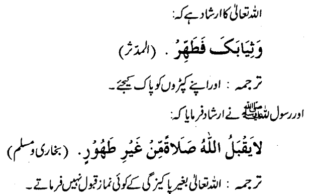
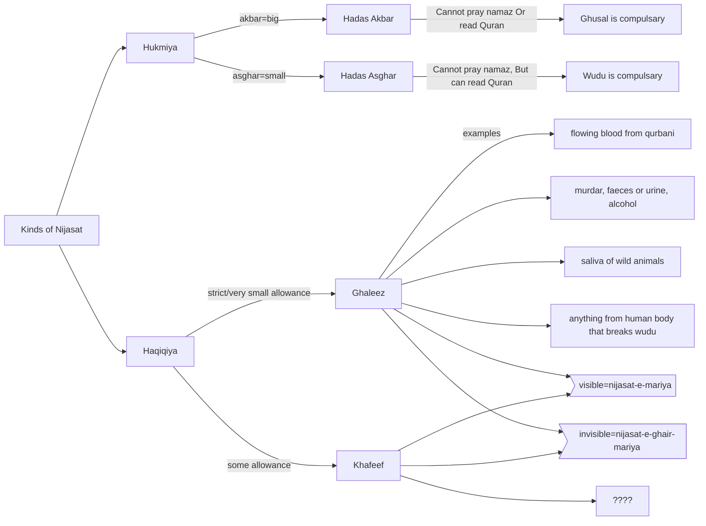
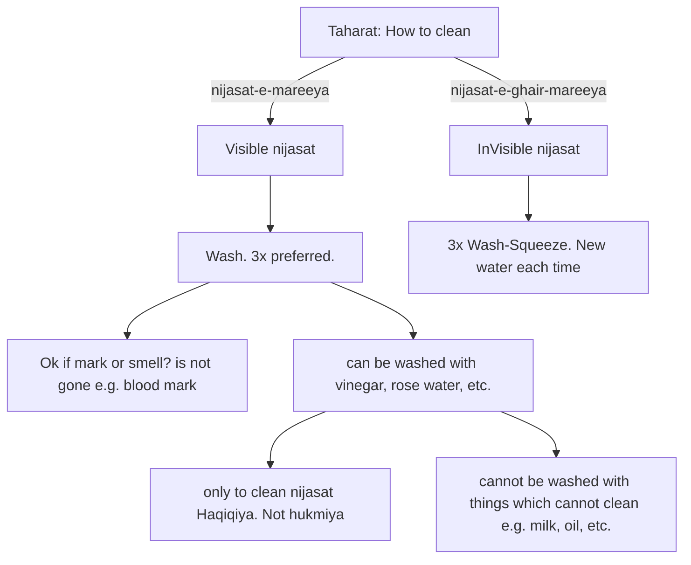
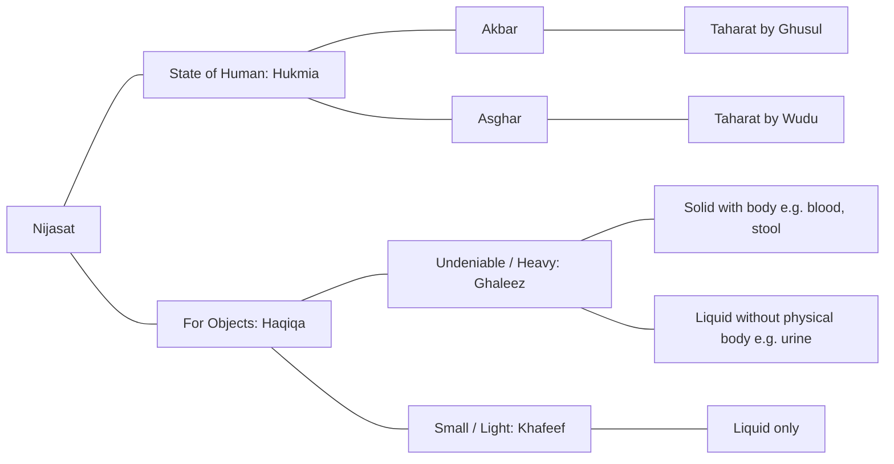
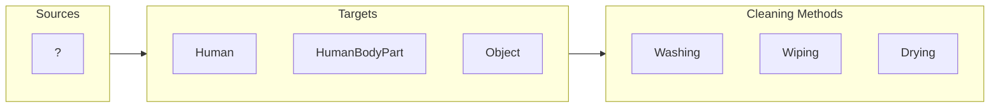
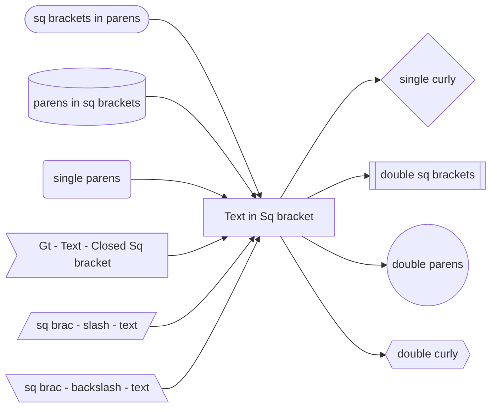

3/12/2022

book: pg 69 / pdf 102

### Important: *read second hadis above!!!*

### Nijasatin

Definition: A condition of body, clothes or place, which are thought as dirty in shariyah.

Two kinds of Nijasat:

1. Hukmiya (also known as Hadas)
   - which is followed under hukum (order) of Allah - whether visible or not
2. Haqiqiya
   - which is visible to us (haqiq = factual)
   - Ghaleeza: no doubts on it being dirty. maaf miqdar (forgiven allowance = low)
     - flowing blood e.g. cut on finger, meat from shop, ...
     - alcohol
     - urine of beasts or haram animals
     - stool, except small birds
     - human excretion (vomit or else) - except infant vomit which is not from deep intestines
     - **Maaf miqdar: Forgiven Allowance**
       - liquid: max allowance (by volume): what can be typically max held in chullo (palm as cup)
         - e.g. qurbani blood staining clothes. Is the staining blood greater than above allowance. If less, namaz is not preferred but allowed e.g. in travel or other circumstances.
       - solid: max allowance (by mass): 4 gm (1 dirham = gold coin of those days)
3. Khafifa
   1. **Khafifa is only for liquids**
   2. Bird beat is neither ghaliza or khafifa --- its okay.
   3. Carnivores are mostly in haram category
      1. urine of these animals is in ghaliza category

   4. Herbivores (e.g. horses) are in halal category
      1. urine of these animals is in khafifa category
      2. btw horses are not preferred to be used for qurbani e.g. they have higher utility for travel

   5. **Max Allowance:**
      1. 1/4th portion of the part of dress is allowed. e.g. 1/4 of sleeve, 1/4 of arm, 1/4 of dupatta

<u>Mixing with water:</u>

1. Ghaliza mixed with water -- makes the whole nijasat ghaleza

   *e.g. full tub of waste is mixed with a drop of water from human waste gutter. Even though nothing is visible, but whole tub water is ghaleez now. Same applies to street gutter overflow.*
2. Khafifa mixed with water --- makes the whole water nijasat khafeef

<u>Blood of certain creations:</u>

1. Aquatic/amphibians animals e.g. frogs, fishes is not najis
2. Small insects e.g. mosquitto, flys  is not najis

Ghaleez meaning undeniable. Alcohol is included in Ghaleez

Chicken and onwards are considered bigger animals. Their excretion is ghaleez.

### Taharat of Objects

### 9 methods of cleaning nijasat

| Cleaning method          | Condition         | Example / Applies to                                         | Notes                                                        |
| ------------------------ | ----------------- | ------------------------------------------------------------ | ------------------------------------------------------------ |
| 1. Washing               |                   | like Ammi taught us                                          | 3x wash+squeeze, or putting under flowing water              |
| 2. Wiping                | Flat surface      | Wipe flat surface without grooves e.g. glass, etc,, if nijasat is not dry. (if dry, wash 3x) | Does not applies to rough surfaces e.g. floor which retain liquid in pores. |
| 3. Drying                | Attached to earth | Earth which **dries in sun** (e.g. for few months) and is not **wet**, has no **body** of nijasat, loses **smell**. Also applicable to anything **attached to earth**,  fixed bricks, attached parts of earth (not detached rocks), grass, plants, ... | The dried object cleaned this way cannot be used for tayammum (but we can pray there). |
| 4. Burning               |                   | BBQ of chicken legs with blood in it.  Using Coal. Using cow dung as fuel after it burns. |                                                              |
| 5. State change          |                   | Cow dung burned as fuel (state changes). Conversion of alcohol to vinegar over time (or by chemical reactions). **Cow fat converted to soap.** |                                                              |
| 6. Zibah                 |                   | Wet animal skin after zibah ????                             |                                                              |
| 7. Animal Hide treatment |                   | After removing moisture from animal hide e.g. to build jackets, coats |                                                              |
| 8. Scratching            |                   | (Not applicable nowadays) Was applicable in older times when nijast didnt absorb in clothing |                                                              |
| 9. Rubbing in soil       |                   |                                                              |                                                              |

Use cases: 

- washing nijasat from carpet: e.g. carpet cleaner with fresh water 3 times.
- 

#### Max Allowance

|                | Ghaleez                                        | Khafeef                             |
| -------------- | ---------------------------------------------- | ----------------------------------- |
| Source of fiqh | *Consistent hadees / confirmed / No variation* | *Multiple varying opinions*         |
| Liquid         | By volume (chullu)                             | 1/4 of part of clothing e.g. sleeve |
| Solid          | By mass (4 gm = weight of 1 dirham)            | N/A                                 |
| Examples       |                                                |                                     |

Source of Nijastin:

1. 

