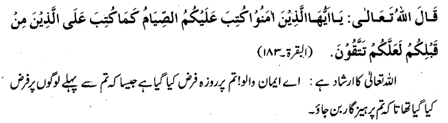
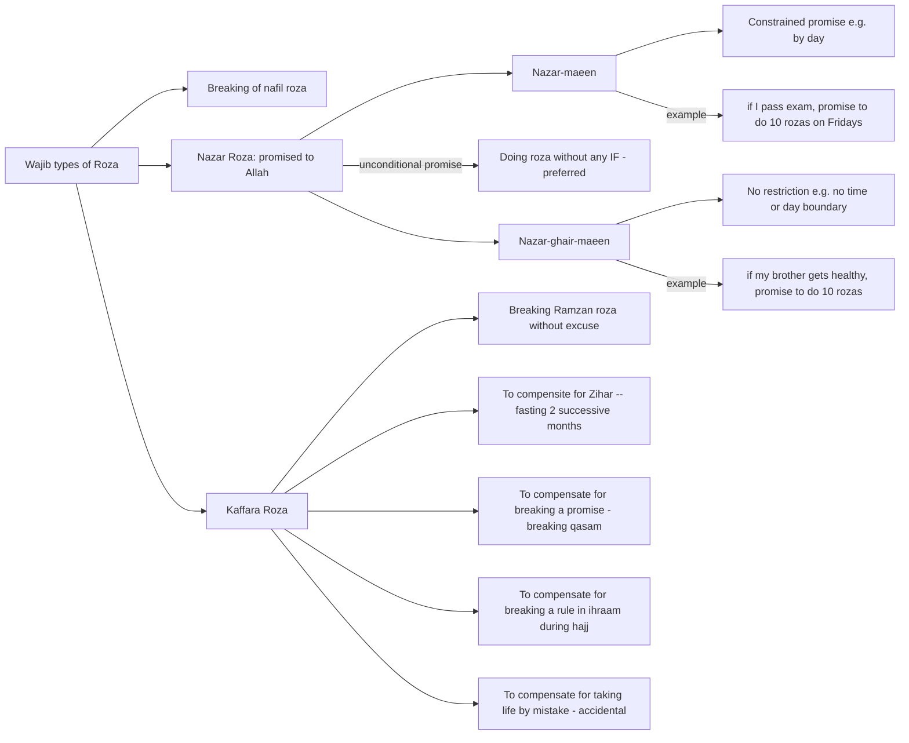
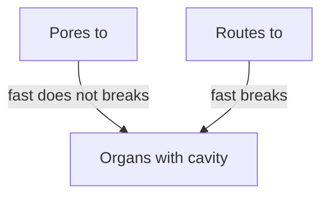

4/2/2022

Roza = Al-imsak = To abstain

### Requirements (Who must do Roza)

1. Being Muslim

2. Being adult

3. Being healthy (body and mind). Otherwise, do qaza after recovery.

4. Being in an Islamic country (dar-ul-islam) or have knowledge of roza in non-muslim country (dar-ul-harb)

5. Being a resident (not traveling; same conditions define traveler as before). While traveling, doing roza is better if possible. Otherwise qaza is mandatory.

6. Women cannot do roza during menstrual days. Instead do qaza afterwards.

**Notes:** 

- Hadas akbar is not an excuse, except for women condition above.
- Dar-ul-islam: where constitution of country is islamic (govt rules are islamic)
- For kids doing roza (who are not adult), there is no kaffara or qaza.

### Types of Roza

| Types                                  | Descr                                                        | Notes                                                        |
| -------------------------------------- | ------------------------------------------------------------ | ------------------------------------------------------------ |
| Farz                                   | Ramzan fasting, if all requirements are met                  |                                                              |
| Wajib                                  | 1. To compensate breaking of nafil roza.  2. Nazar roza (self-created promise to Allah to do roza) 3. Kaffara roza | Two types of Nazar roza: constrainted by day/date/time versus unconstrained. See below graph. |
| Masnoon (preferred by Prophet)         | Muharram 9, 10 and 11                                        | 10th is a sacred day for Muslim for many reasons. 10th is jewish fasting day for their freedom from pharos.  Our prophet said Prophet Musa was closer to us too. So we prefer to fast too.  There are also other reasons for fasting. Hazrat Hussain's rank became higher as his shadat was also on this sacred day. |
| Mustahib (mundoob) - (for extra sawab) | 1. 3 rozas per months on any days 2. Near full moon days (13, 14, 15) 3. Mon, Thu every week 4. Six (6) days of Shawwaal 5. 9th Zil-hij (for non-haji) 6. Alternate days (Saum -e- Daudi) ??? | #2. ayam-e-beiz (beiz = white) #4. 6 days after ramzan (hadis: 30 ramdan +6 shawal is like full year of fasting) #5. one day before eid-ul-azha #6. a habit of Hazrat Daud A.S. |
| Makrooh                                | 1. Only Muharram 9th (not fasting on 10th and 11th) 2. Only fasting on Saturday ??? 3. Continuous fasting, e.g. roza on next day without iftar of previous day (saum -e- wisal) | #2. Torayt and Zaboor was for jewish. They had Sat as the holy day. (just like Muslims=Friday, and Christians=Sunday).  Adding another day make us distinct from others. |
| Haram                                  | 1. Both Eid days 2. Zil-hij 11,12,13 (ayam-e-tashriq ???) | #2. Haj is on Zih-hij 9-13.                                  |

Zihar:  A condemned act. When a man says divorce-like comment (but not divorce) to wife; e.g. "to me, you are like my mother". Husband must compensate before contacting again. Compensation is 2 months successive fasting or feeding sixty people (i think for a day) or freeing a slave. In pre-islamic days, it was equivalent to divorce. https://en.wikipedia.org/wiki/Zihar

### Conditions of roza validity:

1. Doing niyat (more details later)

2. Not eating, drinking or spousal.

3. Women not having periods the whole day.

   

---

### Whats voids roza (muftarrat)

| Conditions                   | Descr                                                        | Does it breaks fast? |
| ---------------------------- | ------------------------------------------------------------ | -------------------- |
| Forgetfulness (nisyan)       | If someone eats or drinks something while forgetting about state of fasting | No                   |
| Unavoidable (ghalba)         | Uncontrollable or Extremely difficult to avoid situation e.g. water goes in ear while taking shower, working in kitchen around aata and its powder goes through throat, some insect flew into mouth and got eaten, \*bed leak while sleeping. If situation is avoidable e.g. do not go in rain with mouth open. Otherwise, such deliberate will break fast. | No                   |
| Life Threatening (ikrah)     | Include threat of life or organ. (Saving life is very important. Let the roza break) | Yes                  |
| By Mistake (khataa)          | Person remember about fasting but does a mistake e.g. while doing wudu, water is swallowed (no intention of swallowing). Note diff from forgetfulness. | Yes                  |
| While asleep (naum)          | While asleep, somehow water gets into the mouth of the person. Note point from unavoidable when roza stays valid.\* | Yes*                 |
| Unconsciousness (ighma)      | Due to illness, etc. if water is swallowed                   | Yes                  |
| Mind out of control (junoon) | If a person gets into this state, and takes water or medicine. | Yes                  |
| Ignorance (jehl)             | Doing things which breaks fast, because of lack of learning. Lack of learning is not an excuse when resources are available. But if a new muslim in a non-muslim country cannot find information, and does a mistake, the fast stays\*. | Yes*                 |

\* see exception

### Terminology

| <u>**Jawf**</u>   | <u>Organs</u>                                                |
| ----------------- | ------------------------------------------------------------ |
| Descr             | Human organs e.g. stomach, intestines, lungs, brain, etc. Jawf means hollow cavity in a human organ. |
| Relevance to Roza | If anything from outside reaches these relevant organs, roza is void. 1. Stomach 2. Throat (including lungs e.g. if tobacco smoke reaches lungs) 3. Intestines 4. Brain (not brain itself, but nose pipe and its connectivity to throat) |
|                   |                                                              |
| <u>**Manfaz**</u> | <u>**Comes from word: nafooz = pathway or route**</u>        |
| Descr             | Pathways in human body which touch Jawf, whether natural (by birth) or created later (e.g. due to some injury). Natural: e.g. nose, mouth, ears, excretion area Unnatural: e.g. due to deep injury that reaches to jawf. |
| Relevance to Roza | Hanafi: if anything reaches, through these any route (natural or unnatural), then fast is void. Sahibeen: Fast is void only if anything reaches via natural routes |
|                   |                                                              |
| <u>**Masam**</u>  | <u>**Pores on skin**</u>                                     |
| Descr             | e.g. pores used for perspiration                             |
| Relevance to Roza | If any external thing reaches to jawf organs via these pores, the fast stays. e.g. applying oil or cream or medicine on skin, injection/drip on skin or blood vein (???) Although eye is a route, but it is considered as a pores. Therefore, rosewater or surma does not break fast. |

next page 321.

