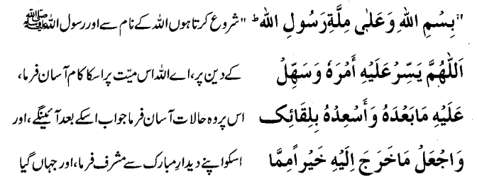
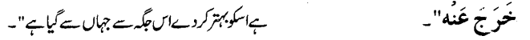
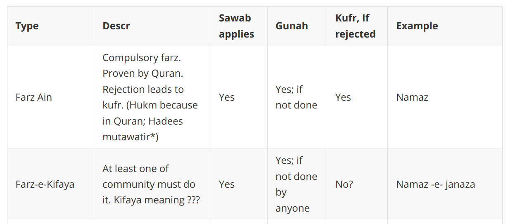
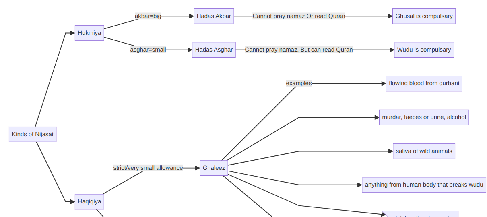
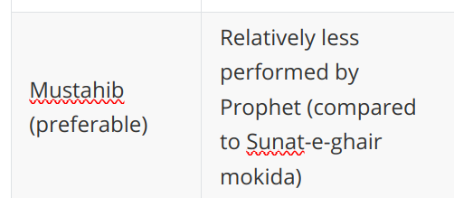
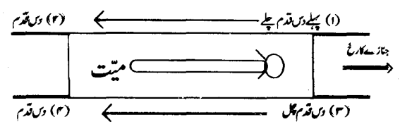
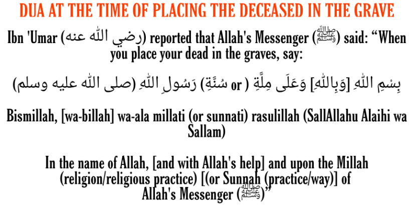
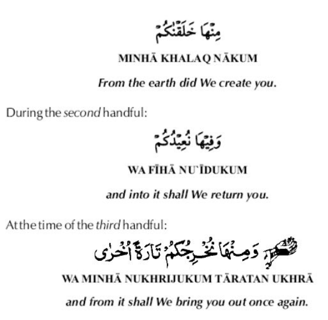
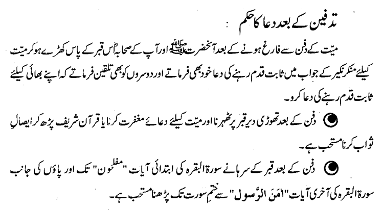

### Death and Burial

12/11/2024

**Last Moments - Dying person:** 

- Recite kalma on his/her own (as the last words; and then stay quiet)
- Try to face towards qibla

**Last Moments - Folks near dying person:**

- Recite kalma shahadat (2nd) - loudly
- Recite Surah Yaseen - it helps against the pains of death.

**After Death:**

- Say: "Inna Lillah e Wa inna ileyhe rajeeoon" (We are Allah's and to Allah we shall return)
- Gently close the eyes. Bind face (chin to head) with some thin cloth. Tie the foot thumbs together.
- Cover body with sheet.
- Do not leave body on ground.
- Put some weight on stomach, so it doesn't swell.
- Do dua while doing (binding) steps:



Translation:

```
I start in the Name of Allah and religion taught by Prophet of Allah. 
O Allah - Make the task easy for this person.
Make the upcoming situations easy for this person
Make them blessed by Your Sight.
Give the person better place compared to where this person previously was.
```

**Next Steps:**

- Announce the death; so many folks can join in janazah
- Avoid recite quran majeed near the person; before qusl is done.


### Qusl (Bath)

- For people alive, it is Farz-e-kifayah. see [link](00-Shared-definitions.md)

**Conditions for Qusl:**

- For muslims only
- Head and at least half of the body is present
- The person was NOT shaheed. Shaheed are buried in same clothing and blood.
- NOT done for unformed unborned child. Baby must have come to live (make sound or movement) before dying
- Done for Baby born dead but body formation was complete.
- Okay to do person who did suicide

Who can do:

- Close relatives; but any other person can do too
- Men to man; Women to woman - should have knowledge of steps
- Someone can be paid to do it; but the person being paid is not getting sawab.
- Wife can do for husband, but husband cannot do for wife.
- Either Men or Women can do qusl for young boy or girl, but if they have grown to near adulthood e.g. teen, then only same gender can do qusl.
- Folks who are napak (hadas e akbar???) cannot do qusl. (see [link](06-Nijasatain.md)) 


#### Qusl Steps:

Items:

- Flat wood board (loban smoked??)
- Cotton roll
- Soap, water
- Bath warm water with cooked leaves of bairy (fruit) ??
- Tiled area so water can easily flow down
- Water with kafoor (?)
- Kafan cloth (? to be described later)


1. Flat wood board (on which person will be bathed). 5-7 put loban smoke?? around that board.
2. Put person on board; "try" that qibla is to the right side.
3. Cover satar (body parts to hide) with thick cloth after removing previous clothes
   1. Whatever was not permitted to view when alive; the same applies after death too.
4. Use gloves and clean just like we clean ourselves after going for #1 or #2
5. Start wudu for person:
   1. Use thick wet cotton piece to clean mouth, teeth, nose. Do not put water inside mouth, nose (even if body in state of hadas akbar)
   2. Put cotton to seal nose, ear, mouth
   3. Similar to wuzu, wash face, arms, head masah, feet x3
6. Wash head with soap
7. Tilt person towards left and use warm water (warmed with leaves) to flow from head to toe (3x)
8. Do the other side (3x)
9. Make the person sit a bit, and then press stomach to release body fluid. No need to do qusl again, if they release.
10. Now flow kafoor water from head to toe 3x on each side tilted.
11. Put kafan cloth on carrying casket, and put body on it gently. 
12. Remove cotton from nose, ear, mouth.

Notes:

- Instead of 3x, 1x washing (flowing water) is fine too
- Raining on body or drowned body is not same is bath. Qusl/wudu is still necessary
- If drowned body is brought out from water, and cleaned while bringing out with niyat of qusl, then qusl is done.
- Person giving qusl should take qusl after doing it (mustahib = preferred) - see [link](00-Shared-definitions.md)  


#### Kafan

- Putting kafan is Farz-e-kifaya (same as qusl; not compulsary; but some must do it)
- Kafan is arranged by near relatives; but others can give it too.
  - If someone was taking care of the person (while dead person was incapable of purchasing kafan), the same caretaker should arrange for kafan
  - If there is no one, then kafan should be arrange from bayt ul maal (muslim reserves)
  - If there is not much in bayt ul maal, then muslim with money should arrange the kafan. 
- Kafan readiness:
  - Prefer while color. Cloth should medium; not very cheap; nor very expensive.
  - Self readiness is good. Prepare kafan for yourself. But do not prepare grave (??? may be due to: we dont know where we will die)
  - Cloth previously soaked with zamzam is okay (some people say its preferred)
  - Do not put anything inside or write kafan (ayat, dua etc.)
  - Do not use kaaba cloth as kafan, if cloth portion has ayats. But rest can be used as kurta or can be sewn in kurta. 
- By Age:
  - Young adults have same kafan as adults
  - Babies or young kids can have fewer cloth: one cloth (boy) and two cloths (girl)
- After wrapping in kafan, it is important to hide person face if its woman, but not for men. That cover sheet is not part of kafan. 


**Types of Kafan**

1. Sunnat (kafan-sunnata) - recommended
2. Sufficient (kafan-kifayat) - minimally required
3. Needed (kafan zaroorata) - in case if no choice; anything that can cover the satar (parts to hide)

| Applies to  | Part           | Descr                                                        | Sunnat | Sufficient |
| ----------- | -------------- | ------------------------------------------------------------ | ------ | ---------- |
| Men & Women | 1. Izaar       | Cloth sheet head to toe                                      | Y      | Y          |
| Men & Women | 2. Lifafa      | Cloth sheet with length > 1.5ft of izaar                     | Y      | Y          |
| Men & Women | 3. Kurta       | Shirt from neck to feet; without arms or kali (open from sides??) -- 2 pieces ?? | Y      |            |
| Women       | 4. Chest cover | Cloth sheet to wrap from armpits to legs or bellybutton.     | Y      |            |
| Women       | 5. Head cover  | Same as dupatta or orh-nee                                   | Y      | Y          |

**Steps to put on kafan** (men)

1. Lay **lifafa** first. 
2. Lay **izaar** on it.
3. Lay **kurta** bottom piece on it (??). Keep kurta top portion above head place. 
4. Put body from qusl board on top of kafan
5. Flip kurta top portion, so it fits around the neck and flows downwards
6. Remove thick cloth that was placed on satar during qusl
7. Put itr/fragrance on body head etc. (Male should not wear saffron smell ??)
8. Rub kafoor on all parts that touch floor when doing sajda (forhead, nose, palms, knees, feet)
9. Wrap the body in izaar. Wrap the left first around, then right one. 
10. Do the same for lifafa. Wrap left first, right one on top.
11. Tie the body to casket (head, middle, feet) to avoid tilting during movement

**Steps to put on kafan** (women)

1. Lay lifafa (bottom most) > chest cover > izaar > kurta bottom portion
2. (same steps as above 4-8). Women can wear saffron fragrance.
3. Split hair in two. Lay each side down towards body
4. Put head cover over head and hairs. Do not tie or wrap tightly.
5. Fold izaar (left first; right on top) > Then chest cover > Then lifafa (same way as men)
6. Tie the body same way.


### Janazah

- For young baby, pass it from two hands to another person two hands.
- For adults, move casket headside first.
- Use hands and shoulders to carry. Do not hold on neck or back. 
- If there is reason, use vehicle or other transport as necessary. (i.e. shorter distance should be by humans)
- **Walking method: (preference via hadees: minimal 40 step combination)**
  - Start with person right side towards head. Walk 10 steps. 
  - Then right side towards feet. Walk 10 steps. 
  - Then go to left side towards head. Walk 10 steps. 
  - Then left side towards feet. Walk 10 steps. 



#### Manners of janazah:

- Walk fast, but not that fast that body is moved
- Walk on foot (mustahib = preferrable). 
- Preferance is to walk behind janazah, but some can walk in front (but not everyone). Do not walk on the side.

- If riding, then do it behind the walking folks (not by the side or the front)
- DO NOT **loudly** recite kalma or dua while walking. (biddat). 
  - Okay to do in heart ?????
- Do not sit down in the middle, if there is no resonable excuse
- Folks who are watching janazah from the side, they should not stand for janazah. 


### Namaz e Janazah

- It is farz-e-kifaya (if no one goes there; then all who knew about it will be sinners). Even one person is sufficient (jamaat not required)

- Folks who didnt know about the death; it is not wrong if they skip it.

- **Timing**: No set timing for it, except **avoid**: sunrise, sunpeak, sunset, if janazah is preplanned. But if its sudden, then even those timings are okay

- **Conditions for person praying:** (All same conditions as regular namaz) + some conditions
  - Additional condition: the praying person must be aware of the death
  - Tayammum: (to read about if regular prayer time is ending ??? tayammum not allowed ??)
    - Wali (closet person) of janazah must do wudu (cannot do just tayammum). They can do another namaz e janazah later.
    - Non-wali of janazah can do tayammum, if there is risk of missing namaz e janazah
  
- **Conditions for dead person:**
  1. Person must be muslim except:
     1. person who died doing treason fight
     2. person who died during robbery 
     3. person who died while inciting violence
     4. person who killed parents
     5. **Note:** If above exception folks are caught, and then killed or die on their own, then namaz-e-janazah is required (except for person who killed parents)
     6. Namaz e janazah is okay to do for person who did suicide
  2. Body must be clean of nijazat haqiqi and hukmia (both) - (see [link](06-Nijasatain.md))
     1. If body has nijasat leaking after qusl, then its okay to do namaz
  3. Body must be present there for namaz e janazah
  4. Body must have satar covered (parts to be hidden)
  5. Body must be in front of namaz, not behind
  6. Body casket must be not be lifted by humans or animals etc, without any excuse
  
  
  
  #### Method:
  
  **Two (2) Farz:**
  
  1. **4x Takbeer** (four times Allahu akbar)
     1. Each takbeer is similar to one rakaat of regular namaz 
  2. **Stand while praying**, except if there is a reason
  
  **Masnoon = Preferred but Optional:**
  
  1. Iman standing aligned with dead person chest
  
  2. Reciting sana after first takbeer (just like regular namaz)
  
     
  
  3. Reciding durood after second takbeer (what we recite after attiyaat)
  
     
  
  4. Due dua for person after 3rd takbeer.


Dua for forgiveness:

- state of **life**: alive or dead
- state of **presence**: here or away
- state of **age**: young or adult
- state of **gender**: male or female
- alive ones on islam, die on iman.


(More notes to do later iA; getting late for Shahab mamoo burial steps: 12/11/2024 10:20 AM)


### Tadfeen

Dua when placing in qabr (grave):




Full body turn towards qibla (not just face)

Untie the knots of kafan, which were placed to keep it still while moving.

When putting soil 3 hands full:




